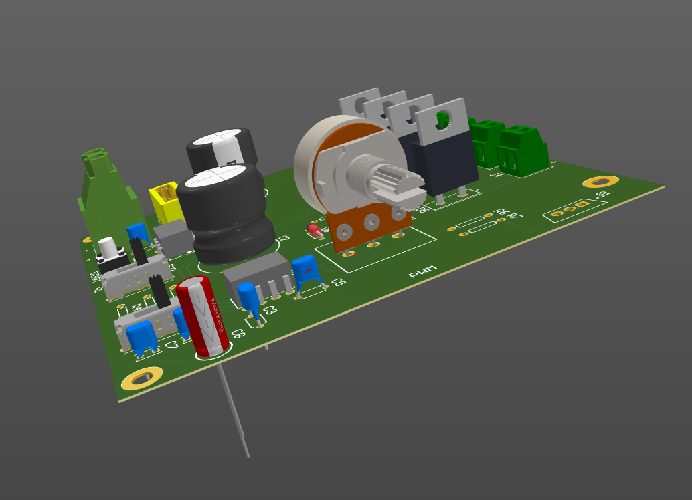
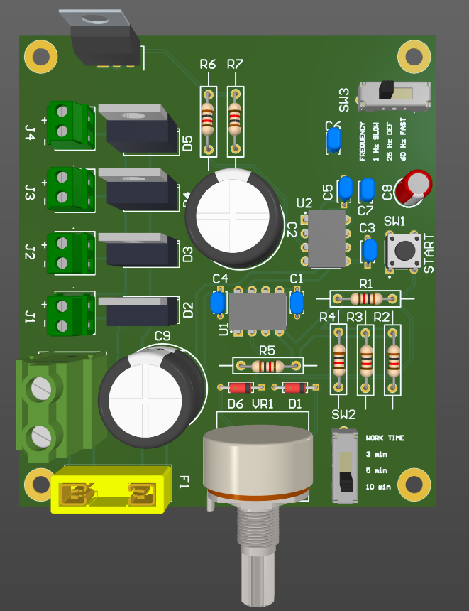
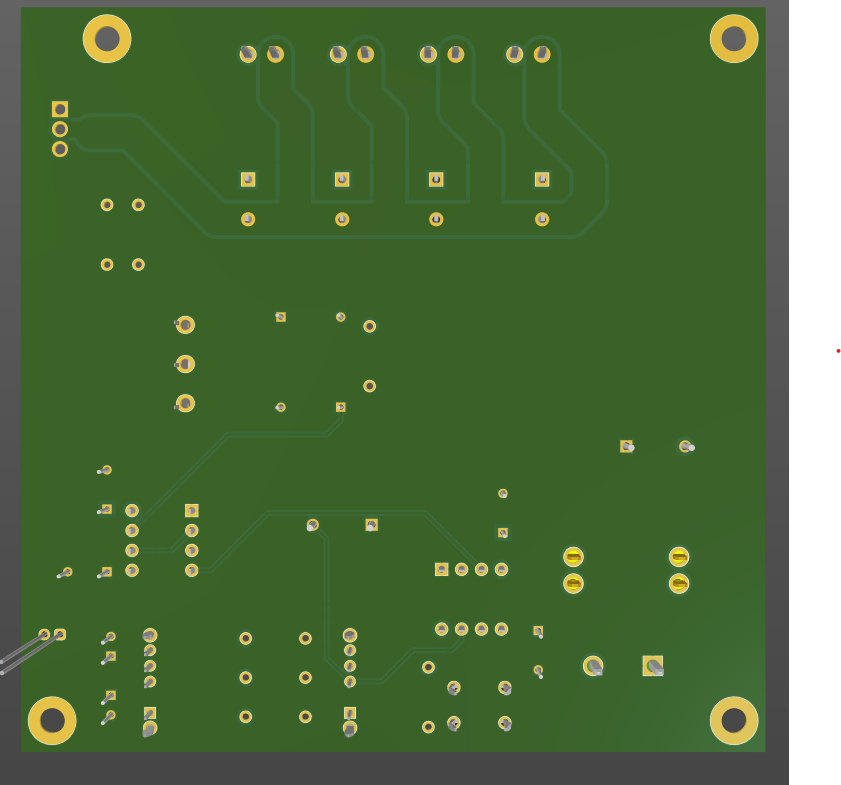
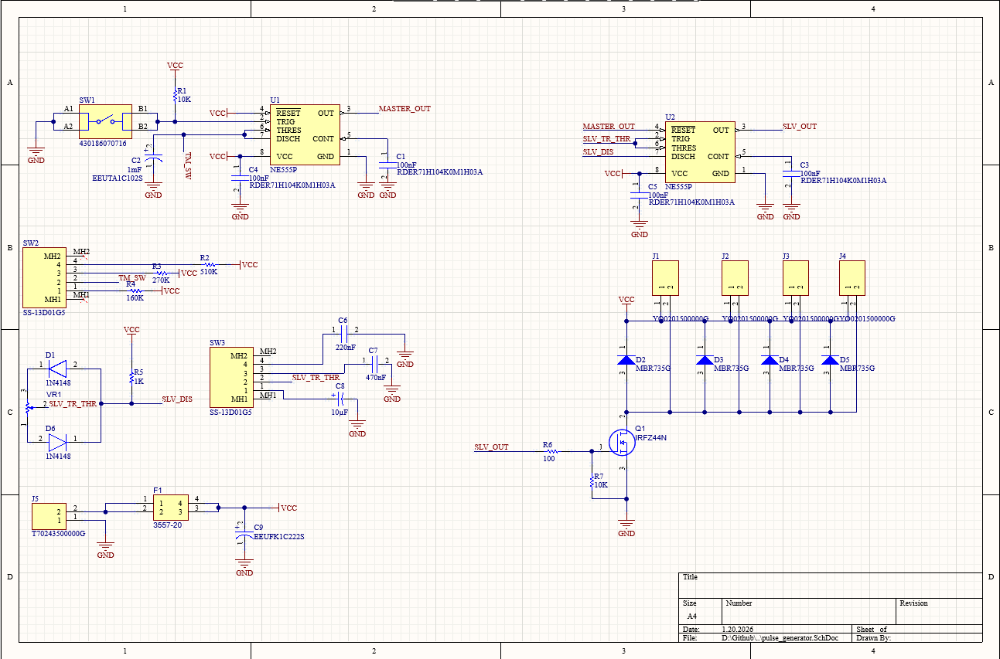

# LPG & Gasoline Injector Pulse Generator / Tester

A professional PCB project for an injector driver designed to test and clean LPG (Liquefied Petroleum Gas) and gasoline fuel injectors. This device generates pulses to open injectors, making it an essential tool for ultrasonic cleaning baths or bench testing.

## 📋 Project Overview

This project is built around the robust **NE555 timer** and the high-performance **IRF3205 MOSFET**. The PCB is engineered specifically to handle high current spikes typical of low-impedance injector coils.

It allows the user to simulate engine operation by driving the injectors, enabling effective cleaning of internal components when submerged in ultrasonic baths.

### Key Features
* **High Current Design:** Powered by an **IRF3205** TO-220 MOSFET, capable of handling significant inductive loads.
* **Thermal Management:** Dedicated Keep-Out Zone and footprint for a substantial heatsink (e.g., Fischer Elektronik SK 09 20 SA) for continuous operation.
* **Open Solder Mask Traces:** The bottom power traces feature exposed copper (no solder mask), allowing for manual tinning to significantly increase current carrying capacity.
* **Robust Connectivity:** Industrial-grade 5.08mm screw terminals (ARK) for secure power and injector connections.
* **Safety:** Integrated fuse holder footprint for circuit protection.

---

## 📸 Design Gallery

### Top Layout
Clean component placement optimized for airflow and easy assembly.

### Bottom Layout (Power Plane)
Features wide, exposed tracks for the high-current path (Drain/Source) to minimize resistance and heat.

### Schematic Diagram
Based on the NE555 astable multivibrator configuration with adjustable frequency/duty cycle.

---

## ⚙️ Technical Specifications

| Parameter | Value |
| :--- | :--- |
| **Dimensions** | ~91mm x 91mm |
| **Layers** | 2 (Top Signal, Bottom Power) |
| **Material** | FR-4 Standard |
| **Thickness** | 1.6 mm |
| **Copper Weight** | 1 oz (35µm) - *Tinning recommended* |
| **Power Input** | 12V DC (Automotive standard) |
| **Mounting** | 4x M3 Mounting Holes |

---

## 🛠️ Bill of Materials (Key Components)

| Designator | Component | Description |
| :--- | :--- | :--- |
| **Q1** | **IRF3205** | N-Channel Power MOSFET, TO-220 |
| **U1** | **NE555P** | Precision Timer DIP-8 |
| **Heatsink** | SK 09 20 SA | Fischer Elektronik (or compatible TO-220 vertical heatsink) |
| **J1 - J4** | ARK 5.08mm | 2-pin Screw Terminal Blocks |
| **VR1** | Potentiometer | For Frequency/Duty Cycle adjustment |
| **F1** | Fuse Holder | Automotive blade fuse holder |

---

## 🚀 Manufacturing (Gerber Files)

Production-ready files are available in this repository. The project has been validated for manufacturing with standard low-cost PCB houses (JLCPCB, PCBWay).

**Files location:**
* `/Project Outputs` contains the raw output.
* Check the **Releases** section for the zipped `Pulse_generator_gerber_files.zip`.

**Recommended Ordering Settings:**
* **Layers:** 2
* **Thickness:** 1.6mm
* **Solder Mask:** Green (or preferred color)
* **Surface Finish:** HASL (Lead or Lead-Free)
* **Remove Order Number:** Specify "Yes" if you want a clean look.

---

## ⚠️ Disclaimer

**Use at your own risk.** This device controls fuel injectors which operate with flammable liquids and high currents.
* Always ensure proper ventilation when working with fuel.
* Ensure the MOSFET is properly isolated if the heatsink is not grounded.
* The authors is not responsible for any damage to injectors, power supplies, or other equipment resulting from the use of this project.

---
*Designed in Altium Designer.*
